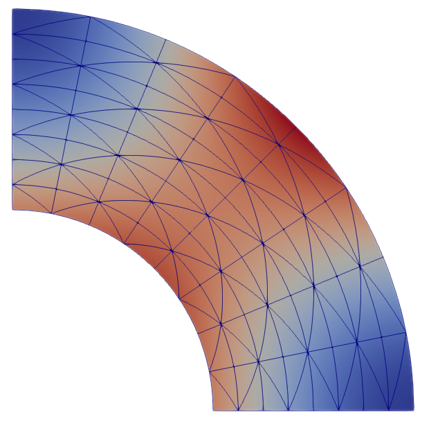

Examples
========

In the tandem repository you find many `examples <https://github.com/TEAR-ERC/tandem/tree/master/examples>`_.
The folders :code:`poisson` and :code:`elasticity` contain test problems for the
Poisson and Elasticity solvers.
In the folder :code:`tandem` you find :abbr:`SEAS ( Sequences of Earthquakes and Aseismic Slip)` models.
The folder :code:`options` contains PETSc solver configurations.

Elasticity problem
------------------

From the build directory, run

.. code:: console

   $ ./app/static ../examples/elasticity/2d/cosine.toml --output cosine

After a successful run, there should be the file :code:`cosine.pvtu` in your
build directory.
The pvtu-file can be visualized with `ParaView <https://www.paraview.org/>`_.
Cf. the following visualization of the cosine example:

Along with the pvtu-file, you also get console output, e.g.

.. code:: none

   Solver warmup: 0.120276 s
   Solve: 0.310153 s
   Residual norm: 1.20671e-11
   Iterations: 127
   L2 error: 2.88579e-09

We see that we need quite a number of iterations to solve this problem.
Let's use a LU-decomposition instead of an iterative solver:

.. code:: console

   $ ./app/static ../examples/elasticity/2d/cosine.toml --output cosine \
         --petsc -options_file ../examples/options/lu_mumps.cfg

The console output should be similar to the following:

.. code:: none

   Solver warmup: 0.194319 s
   Solve: 0.00834613 s
   Residual norm: 0
   Iterations: 1
   L2 error: 2.88579e-09

We see that the warm-up time increased but the solve time decreased a lot.
Moreover, we only need 1 "iteration" as we used a direct solver.

Now open up the parameter file, :code:`cosine.toml`:

.. code:: toml

   resolution = 0.125

   [elasticity]
   lib = "cosine.lua"
   ...

The cosine example uses a generated mesh, therefore we can adjust the mesh
resolution in the parameter with the :code:`resolution` parameter.
You could now edit the parameter file to adjust the resolution.
Alternatively, you can override top-level parameters from the command line:

.. code:: console

   $ ./app/static ../examples/elasticity/2d/cosine.toml --output cosine \
         --resolution 0.0625 --petsc -options_file ../examples/options/lu_mumps.cfg

You should now see

.. code:: none

   Solver warmup: 0.760638 s
   Solve: 0.0306711 s
   Residual norm: 0
   Iterations: 1
   L2 error: 2.42624e-11

The solve and warm-up time increased considerably, but also the error is lower.
Indeed, comparing the errors with

.. math::

   \log_2\left(\frac{2.88579\cdot 10^{-9}}{2.42624\cdot 10^{-11}}\right) \approx 6.9

shows that the empirical convergence order is close to the theoretical convergence
order 7. (Assuming that you compiled tandem with :code:`POLYNOMIAL_DEGREE=6`.)

SEAS problem
------------

.. attention::

   Please install `Gmsh <https://gmsh.info/>`_ for this section.

On your local machine, go to the folder :code:`examples/tandem/2d` and run

.. code:: console

   $ gmsh -2 bp1_sym.geo -setnumber Lf 0.5

You have now created a mesh with an on-fault resolution of 0.5 km.
Now go to your build folder (inside the Docker container, if you used Docker) and run:

.. code:: console

   $ ./app/tandem ../examples/tandem/2d/bp1_sym.toml \
         --petsc -options_file ../examples/options/lu_mumps.cfg \
         -options_file ../examples/options/rk45.cfg -ts_monitor 

In comparison to the Elasticity example, we added the :code:`rk45.cfg` options
file which selects an adaptive Runge-Kutta time-stepping scheme.
The option :code:`-ts_monitor` enables monitoring of time and time-step size.

Time to fetch a coffee, as this is going to take a while.
In order to speed things up, add :code:`--mode QDGreen`:

.. code:: console

   $ ./app/tandem ../examples/tandem/2d/bp1_sym.toml --mode QDGreen \
         --petsc -options_file ../examples/options/lu_mumps.cfg \
         -options_file ../examples/options/rk45.cfg -ts_monitor 

Tandem now spends some time in a pre-computation step, but the time-stepping itself
will be much faster.

The code logs the slip rate and other quantities at certain points and saves 
those in the :code:`fltst_*` files.
You can view these files using the `viewrec <https://github.com/SeisSol/SeisSol/tree/master/postprocessing/visualization/receiver>`_ tool from the SeisSol project --
even when tandem is still running.
